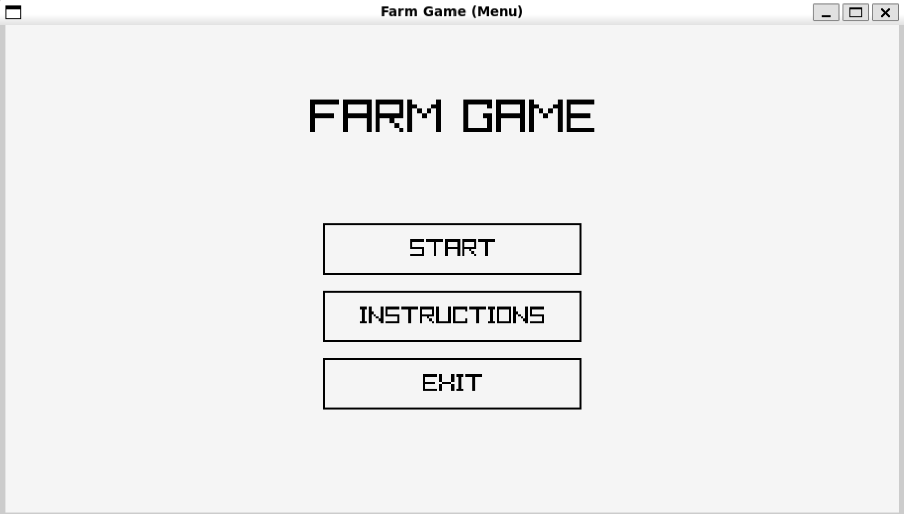
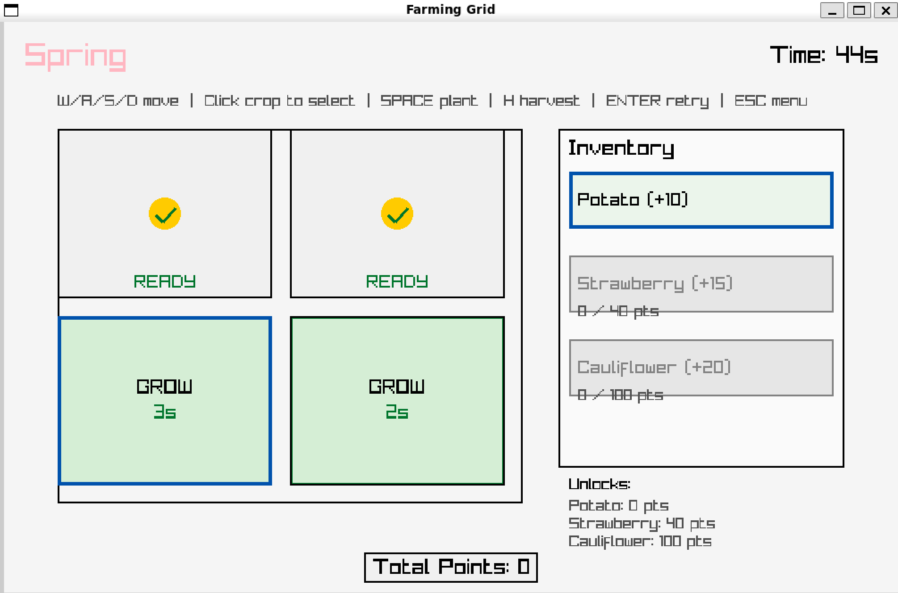

# Farming Simulation Game (C++)
## Overview
A farming simulation game developed in C++ featuring both a command-line interface and a graphical user interface built with Raylib. The game uses object-oriented design principles to manage seasonal progression, crop lifecycles, and player interaction.
## Screenshots 



## Features
* Dual implementation: console + GUI version
* Seasonal progression system (Spring → Winter)
* Crop lifecycle: plant → grow → harvest
* Time-based gameplay and scoring system
* Multiple crop types with unique behaviours
* Object-oriented architecture (inheritance, polymorphism, state pattern)

## Concepts
* Object-Oriented Programming (OOP)
* State management using class design
* Polymorphism for dynamic crop behaviour
* Modular system design

## Set-up and Installation
## Prerequisites

- **Raylib library** (for the GUI version)
- **C++ compiler** (g++)

### Installing Raylib on Linux/WSL2:

```bash
sudo apt update
sudo apt install libraylib-dev
```

## Compilation

### Using Makefile (Recommended):

```bash
# Compile both versions
make all

# Compile only console version
make console

# Compile only GUI version  
make gui

# Clean compiled files
make clean
```

### Manual Compilation:

**Console Version (Text-based):**
```bash
g++ -o console_farming_game main.cpp Autumn.cpp Beetroot.cpp Carrot.cpp Cauliflower.cpp CropState.cpp Eggplant.cpp Game.cpp Harvestable.cpp Harvested.cpp Kale.cpp Lettuce.cpp Onion.cpp Peas.cpp Planted.cpp Player.cpp Potato.cpp Season.cpp Seed.cpp Spring.cpp Strawberry.cpp Summer.cpp Tomato.cpp Wheat.cpp Winter.cpp
```

**GUI Version (Raylib-based):**
```bash
g++ -o gui_farming_game RaylibOpeningSlide.cpp FarmingGrid.cpp -lraylib -lm -lpthread -ldl -lrt -lX11
```

## Running the Game

### Console Version:
```bash
./console_farming_game
```

### GUI Version:
```bash
./gui_farming_game
```

## Game Versions

1. **Console Version** (`console_farming_game`): A text-based farming game where you plant, grow, and harvest crops through the seasons.

2. **GUI Version** (`gui_farming_game`): A graphical farming game with visual interface using Raylib.

## Project Structure

- `main.cpp` - Entry point for console version
- `RaylibOpeningSlide.cpp` - Entry point for GUI version  
- `FarmingGrid.cpp` - GUI game logic
- `Game.cpp/h` - Core game mechanics
- `Player.cpp/h` - Player management
- `Season.cpp/h` - Season management
- Various crop files (`Carrot.cpp`, `Tomato.cpp`, etc.) - Individual crop implementations

## Future Improvements
* Enhanced GUI and animations
* Save/load functionality
